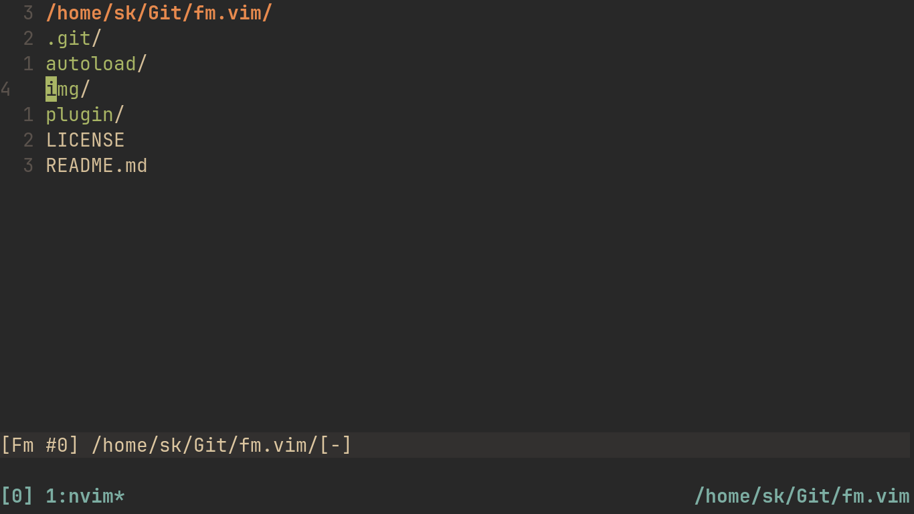

# Fm


A simple and DWIM file manager for Vim.

## Install
Use your plugin manager of choice to install this plugin.

| Plugin manager | Command                                                                  |
| -------------- | ------------------------------------------------------------------------ |
| [Vim Plug](https://github.com/junegunn/vim-plug)  | `Plug 'shoumodip/fm.vim'`             |
| [Vundle](https://github.com/VundleVim/Vundle.vim) | `Plugin 'shoumodip/fm.vim'`           |
| [Dein](https://github.com/Shougo/dein.vim)        | `call dein#add('shoumodip/fm.vim')`   |
| [Minpac](https://github.com/k-takata/minpac)      | `call minpac#add('shoumodip/fm.vim')` |

Or use the builtin packages feature.

| Editor | Path                                   |
| ------ | ----                                   |
| Vim    | `cd ~/.vim/pack/plugins/start`         |
| NeoVim | `cd ~/.config/nvim/pack/plugins/start` |

```console
$ git clone https://github.com/shoumodip/fm.vim
```

## Usage
| Command      | Description                   |
| ------------ | ----------------------------- |
| `Ex[plore]`  | Open Fm in the current window |
| `Sex[plore]` | Open Fm in a split            |
| `Vex[plore]` | Open Fm in a vertical split   |
| `Tex[plore]` | Open Fm in a new tab          |

## Keybindings
| Key                  | Description                                                                  |
| -------------------- | ---------------------------------------------------------------------------- |
| <kbd>Backspace</kbd> | Enter Parent Directory                                                       |
| <kbd>Enter</kbd>     | Enter item under the cursor                                                  |
| <kbd>f</kbd>         | Create a file                                                                |
| <kbd>d</kbd>         | Create a directory                                                           |
| <kbd>x</kbd>         | Toggle mark for the item under the cursor                                    |
| <kbd>X</kbd>         | Toggle marks in the current directory                                        |
| <kbd>D</kbd>         | Delete marked items, otherwise item under the cursor                         |
| <kbd>m</kbd>         | Move marked items into the current directory                                 |
| <kbd>c</kbd>         | Copy marked items into the current directory                                 |
| <kbd>r</kbd>         | Reload                                                                       |
| <kbd>R</kbd>         | Rename item under the cursor                                                 |
| <kbd>+</kbd>         | Add permissions to the item under the cursor                                 |
| <kbd>-</kbd>         | Remove permissions from the item under the cursor                            |
| <kbd>!</kbd>         | Execute a shell command on the marked items, otherwise item under the cursor |
| <kbd>i</kbd>         | Enter insert mode                                                            |
