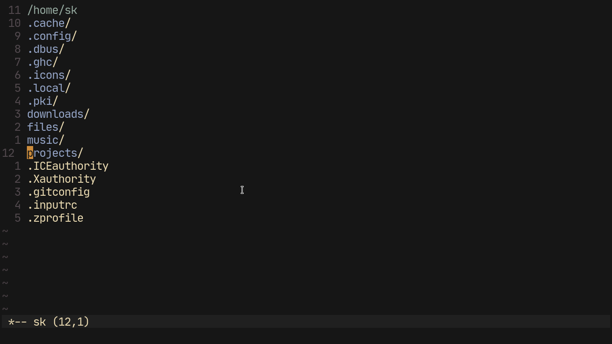
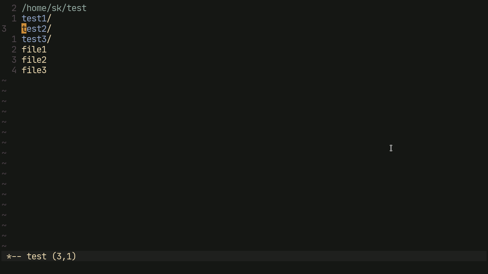

# Fm.vim


A hyper-extensible minimal file manager for Vim. This aims to solve all of the bugs and issues I have encountered when attempting to use Netrw.

## Pros
- Extremely minimal, only 444 SLOC. Compare that to netrw (over 10000).
- Necessary features are built in with smarter (imho) implementations.
- Edit mode, just this should be enough. (Check description below)
- Configurable and completely scriptable. (See the API documentation below)
- Fast, uses GNU `ls` instead of `glob()`. Out performs netrw as a result.
- No stupid help menu blocking half of the screen by default.

## Cons
- Extremely minimal, doesn't include the kitchen sink.
- Not included in Vim by default, increases your plugin dependency.
- Won't work on windows, depends on UNIX utilities.
- Requires GNU `ls` for the `--group-directories-first` option.

## Install
Install this like any other vim plugin. Here are some copy-pasta commands.

### Plugin Managers
```vim
" Vim plug
Plug 'shoumodip/fm.vim'

" Vundle
Plugin 'shoumodip/fm.vim'

" Dein
call dein#add('shoumodip/fm.vim')

" Minpac
call minpac#add('shoumodip/fm.vim')
```

### Manual
```sh
# Pathogen
cd ~/.vim/bundle && git clone https://github.com/shoumodip/fm.vim

# Vim 8 builtin package system
cd ~/.vim/pack/plugins/start && git clone https://github.com/shoumodip/fm.vim

# Neovim alternatives
cd ~/.config/nvim/bundle && git clone https://github.com/shoumodip/fm.vim
cd ~/.config/nvim/pack/plugins/start && git clone https://github.com/shoumodip/fm.vim
```

## Features
Some of the features of `fm.vim`. Throughout the features list, whenever I mention '**items**', I mean files/directories.

### Basic keybindings
- `l` or `<CR>` Open the item under the cursor.
- `h` or `<BS>` Go up a directory. (Like `cd ..`)
- `q` Close fm.
- `R` Refresh fm.

### Open Fm
- `:Explore` open fm in the current window.
- `:Sexplore` open fm in a new split.
- `:Vexplore` open fm in a new vertical split.
- `:Texplore` open fm in a new tab.

### Select items (`x`)
This is the main reason why I even need a file manager in the first place. Files and directories which you can't just glob match your way through, good luck maintaining patience in the terminal.

### Toggle selection of all (`X`)
Exactly what the title says. Select everything in the current directory if not selected, else de-select everything.

### Toggle hidden items (`H`)
Whether hidden files should be displayed. It is basically toggling the `-A` flag in ls.

### Move items to a directory (`m`)
Move items to a directory. If there are selected items, they get moved. Otherwise work on the item under the cursor.

### Delete items (`D`)
Delete items. If there are selected items, they get deleted. Otherwise delete the item under the cursor. ***Warning:*** this removes items recursively (`rm -rf`), be careful with this. By default this will ask for confirmation, but take extra precaution before deleting if `g:fm#require_confirm` is set to a "falsy" value.

### Copy items to a directory (`c`)
Copy items to a directory. If there are selected items, they get moved. Otherwise work on the item under the cursor. (*Fun fact:* it is the same function as the move items feature.)

### Rename items (`r`)
Rename files and directories. Uses full paths instead of relative paths, so you can use this to move items around as well. Unix rocks!

### Create files (`f`) or directories (`d`)
Extremely useful functions for creating files and directories. The main advantage of this is that non-existant parent directories get automatically created. So if you wish to create a file `~/foo/bar/baz` but the directory `~/foo/bar` doesn't exist, it will take confirmation if needed (`g:fm#require_confirm`) and create the parent directories if confirmed. I consider this a literal lifesaver.

### Edit mode (`e`)
This is a feature I originally found in Emacsland. Basically it turns the current directory view into an editable buffer. There you make all the changes you want and upon saving, the changes will get reflected onto your actual file structure.  I can't even *begin* to emphasise on how useful a feature it is. Imagine this, renaming tons of files and directories using **true** Vim keys. Will all your plugins. In fact this concept is so awesome I even included a gif to demonstate it. Emacs may not be as finger-friendly as Vim but you have to admit it, it has some ***amazing*** built-in functionality!

On opening the edit buffer, make the changes you want and save in order to, you know, save the changes. To abort the changes, kill the buffer. Or press `<C-c>` in Normal mode.



### Actions (`.` and `!`)
This was one of my major frustations about Netrw. Figuring out the path to the selected item is *so damn hard*. Especially when `g:netrw_liststyle` is set to 3. Therefore this was the thing I paid special attention to make extremely simple and *built-in*. Pressing `.` will open Command (`:`) mode with the items already there and the cursor at the beginning of the line. Pressing `!` will open the Command mode with the items after the cursor and the shell command (`!`) before it. See the API documentation for more information about this.

## API
The strongest point of Fm mode. It has a lot of scripting capabilities.

### `fm#get_items()`
Returns a list of the selected items. If there are none, it will return a list containing the item under the cursor. This can be used to make custom functionality. For example, a 'trash' function.

```vim
function! Trash()
  let items = join(fm#get_items(), " ")
  let cmd = "mv " . items . " ~/Trash" " Let '~/Trash' be the trash directory

  silent! call system(cmd)
  return ""
endfunction

" Map it to 't'. You know, 't' for 'Trash'. Makes sense?
let g:fm#keys["t"] = "Trash"
```

Now `t` is a keybind which will run your custom function `Trash()` in Fm. The possibilities with this are virtually endless. By the way don't worry about escaping the items, `fm#get_items` does that automatically for you.

### `fm#action(TEXT, KEY)`
Take all the selected items (or the current line, depends) and place them in the command mode prompt separated with a space. This is the function behind the `.` and `!` keybindings. It takes two optional parameters, the `TEXT` to place before the cursor and the `KEY` to press after placing the items in the command prompt. For example this is the `!` keybinding.

```vim
let g:fm#keys["!"] = "action('!', '\<Home>\<Right>')"
```

Note that the keys pressed after the item placement have to in `feedkeys()` notation, not the standard `key-notation`.

### `fm#open(ITEM)`
Open the optional `ITEM` argument or the item under the cursor.

### `fm#prompt(MESSAGE, ONE-CHAR)`
A little wrapper around `input()`. The `MESSAGE` argument is used as the prompt. If the optional `ONE-CHAR` is "truthy", then use `getchar()` instead of `input()`. This is used for all interactive prompts in Fm.

### `fm#confirm(MESSAGE)`
A little wrapper around `fm#prompt()`. Essentially this is a yes-no prompt where the only keys that work are `y`, `Y`, `n`, `N` and `<Esc>`. This is used for all confirmation messages in Fm.

### `fm#draw_selects()`
Re-highlight the selected items.

### `fm#set_cursor()`
Position the cursor according to the history. Let me explain that. Say you visit a directory named `foo`. After that you decided to go back to the parent directory and go to a directory `bar`. Now you again go back to the parent directory and navigate to `foo`. Fm will automatically position your cursor on the line it was last present on in the `foo` directory. Same goes for `bar` and every single directory in your computer.

### `fm#toggle()`
Toggle the selection of an item and move the cursor one line down. Say you don't want the cursor to move one line down after toggling an item.

```vim
function! GoingDownIsForRetards()
  silent! call fm#toggle()
  normal! k

  return ""
endfunction

let g:fm#keys["x"] = "GoingDownIsForRetards"
```

### `fm#toggle_all()`
Toggle the selection of everything in the directory.

### `fm#toggle_hidden()`
Toggle the visibility of hidden items in Fm.

### `fm#rename(NAME)`
Rename an item. If the optional argument `NAME` is not supplied, it will take an input from the user using `fm#prompt()` and use that as the new name for the item. If the `NAME` argument *is* supplied, it will perform a simple check. If the name contains a slash, it will treat the name as the absolute path to the new item. If a slash is not present, it will perform the rename relative to the current directory.

Let's say you don't use version control and wish to create a backup.

```vim
function! CreateBackup()
  silent! call fm#rename(substitute(getline('.'), '/$', '', 'g') . "_backup")

  return ""
endfunction

let g:fm#keys["b"] = "CreateBackup"
```

### `fm#new(TYPE, NAME)`
Create a new item. The argument `TYPE` has to be either 'file' or 'directory'. The optional argument `NAME` is the name of the file/directory. The relative and absolute auto detection is the same as `fm#rename()`. Likewise, if it is not provided, it will use `fm#prompt` to take an input from the user.

### `fm#delete()`
Delete the selected item(s). If there are selected items, it will only delete those, not the current line. Otherwise it will delete the current line.

### `fm#move(COPY, DIR)`
Move selected item(s) to a directory. The optional argument `COPY` is used to decide whether the items should be copied or not. The optional `DIR` argument sets the destination directory. Same rules as those of `fm#rename` and `fm#create`.

```vim
" The move and copy keybindings
let g:fm#keys["m"] = "fm#move()"
let g:fm#keys["c"] = "fm#move(1)"

" Another trash function. 0 is a 'falsy' value, therefore it's a move, not a copy
let g:fm#keys["t"] = "fm#move(0, '~/Trash/')"
```

### `fm#edit_start()`
Start edit mode.

### `fm#edit_close()`
Close edit mode.

### `fm#edit_save()`
Save changes and close edit mode.

### `fm#close()`
Close Fm.

### `fm#edit()`
Wrapper around `:edit`.

### `fm#change_dir(DIR)`
Change the current directory of FM (***NOT*** vim) to `DIR`. Works exactly like the `cd` command, except for the `-` argument. I have not implemented that yet.

### `fm#up()`
Go back a directory, overwrite the history cursor position and position the cursor on the directory it was just in.

### `fm#mappings()`
Generate the buffer-local normal mode mappings for Fm.

### `fm#start()`
Start Fm.

### `g:fm#ls_opts`
The options supplied to ls by default. Set to `--group-directories-first -Fv ` by default. ***NOTE:*** Don't put `-A` or `-a` in there and expect the hidden visibility toggle to work. If you wish to change the default visibilty behaviour of Fm, change `g:fm#show_hidden`.

### `g:fm#show_hidden`
Whether hidden items should be shown by default. Set to 1 by default (will show).

### `g:fm#require_confirm`
Whether Fm should ask for confirmation before overwriting or deleting items. Set to 1 by default (will ask). This overwrites the behaviour of `fm#confirm`, so all calls of that function will simply return "y" instead of asking for confirmation. Therefore use `fm#confirm` in your functions so as to achieve a uniform interface across all your confirmations and prompts.

### `g:fm#keys`
The global list of Fm keybindings. It is a dictionary of the `KEY = FUNCTION` format, with a little bit of syntactic sugar. If you wish to pass no arguments to the function, just write the function name without the parenthesis. However putting in the parenthesis in a function which doesn't take any arguments is ***NOT*** an error, just so you know.

```vim
let g:fm#keys = {
      \ "l"   : "fm#open",
      \ "h"   : "fm#up",
      \ "<CR>": "fm#open",
      \ "<BS>": "fm#up",
      \ "f"   : "fm#new('file')",
      \ "d"   : "fm#new('directory')",
      \ "r"   : "fm#rename",
      \ "D"   : "fm#delete",
      \ "q"   : "fm#close",
      \ "x"   : "fm#toggle",
      \ "X"   : "fm#toggle_all",
      \ "R"   : "fm#refresh",
      \ "H"   : "fm#toggle_hidden",
      \ "e"   : "fm#edit_start",
      \ "m"   : "fm#move",
      \ "c"   : "fm#move(1)",
      \ "."   : "fm#action",
      \ "!"   : "fm#action('! ', '\<Home>\<Right>')",
      \ }
```

This is the default value of this variable.

### Settings not working!
The afforementioned settings are used as the global settings for Fm. Therefore once you launch an instance of Fm, changing those will have no effect on the already open Fm buffer. The changed settings will have effects on Fm buffers opened *later*. If you wish to change the settings of an already open Fm buffer, you need to change its buffer-local settings. The naming is simple, just use `b:fm_` instead of `g:fm#`. For example `g:fm#require_confirm` becomes `b:fm_require_confirm`.

### Colors
- `fmDirectory` Directories in Fm. Links to `fmPrompt`.
- `fmExecutable` Executable files in Fm. Links to `Operator`.
- `fmLink` Symlinks in Fm. Links to `Include`.
- `fmCurrent` The current directory shown in the first line. Links to `Operator`.
- `fmSelected` The selected items. Links to `Visual`.
- `fmPrompt` The custom prompts of Fm. Links to `Function`.

## License
MIT
